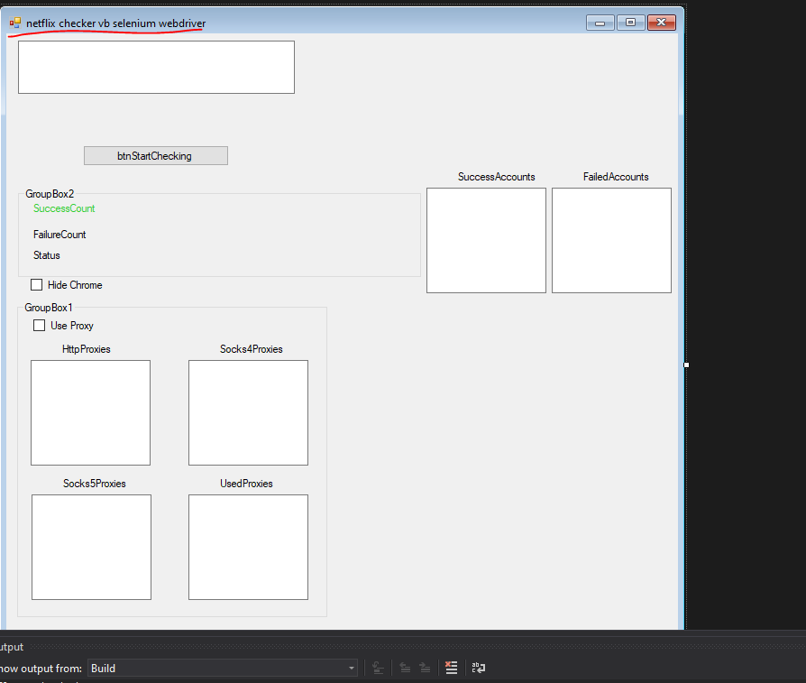

# netflix-checker-vb-selenium-webdriver
netflix checker vb.net  using selenium webdriver

                Dim emailField As IWebElement = wait.Until(Function(d) d.FindElement(By.XPath("/html/body/div[1]/div/div/div[2]/div/form/div[1]/div/div[1]/input")))
                Dim passwordField As IWebElement = wait.Until(Function(d) d.FindElement(By.XPath("/html/body/div[1]/div/div/div[2]/div/form/div[2]/div/div[1]/input")))
                Dim loginButton As IWebElement = wait.Until(Function(d) d.FindElement(By.XPath("/html/body/div[1]/div/div/div[2]/div/form/button[1]")))

-- --

                        Dim elementAfterLogin = wait.Until(Function(d) d.FindElement(By.XPath("/html/body/div[1]/div/div/div[1]/div[1]/div[2]/div/div/h1")))

                            Dim errorElement = wait.Until(Function(d) d.FindElement(By.XPath("/html/body/div[1]/div/div/div[2]/div/header/div")))
